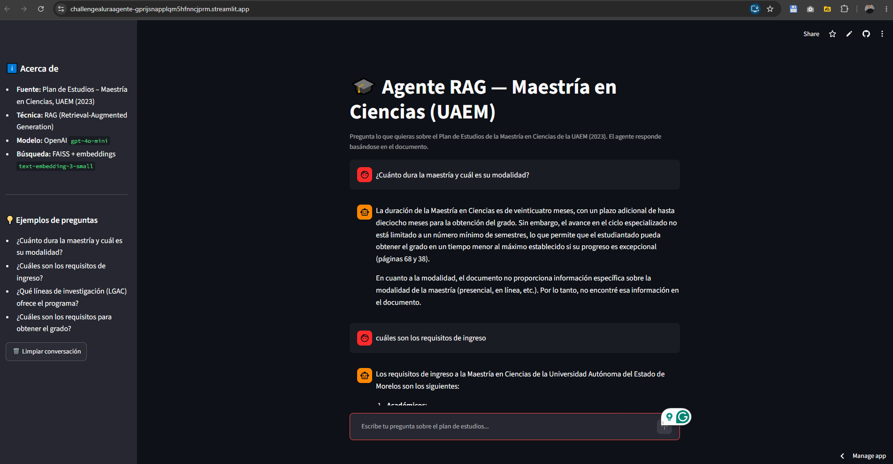

# 🎓 Agente RAG — Plan de Estudios Maestría en Ciencias (UAEM)

Agente de inteligencia artificial que responde preguntas en lenguaje natural sobre el **Plan de Estudios de la Maestría en Ciencias de la Universidad Autónoma del Estado de Morelos (UAEM), 2023** (documento PDF de 623 páginas).

Proyecto desarrollado como **Challenge final de Alura / ONE — Track Tech AI Builder**.

---

## 📋 Descripción del problema

Los planes de estudio universitarios son documentos extensos (este tiene **623 páginas**) donde encontrar información concreta —requisitos de ingreso, duración, líneas de investigación, requisitos de titulación— es tardado y tedioso.

Este proyecto resuelve ese problema con un **agente conversacional** al que cualquier persona (aspirantes, estudiantes, personal administrativo) puede hacerle preguntas directas y obtener respuestas precisas, **basadas exclusivamente en el contenido del documento** y con **cita de la página** de origen.

---

## 🏗️ Arquitectura de la solución

El proyecto usa la técnica **RAG (Retrieval-Augmented Generation)**: en lugar de mandar las 623 páginas al modelo (imposible y costoso), se buscan solo los fragmentos relevantes a cada pregunta y se le entregan como contexto al modelo de lenguaje.

```
                        FASE 1: INGESTA (una sola vez, ingest.py)
   ┌──────────┐     ┌──────────────┐     ┌────────────────┐     ┌──────────────┐
   │   PDF    │ ──▶ │  Fragmentado │ ──▶ │   Embeddings   │ ──▶ │  Índice      │
   │ 623 pág. │     │ (chunks)     │     │  (OpenAI)      │     │  FAISS       │
   └──────────┘     └──────────────┘     └────────────────┘     └──────────────┘

                        FASE 2: CONSULTA (en cada pregunta, app.py)
   ┌──────────┐     ┌──────────────┐     ┌────────────────┐     ┌──────────────┐
   │ Pregunta │ ──▶ │  Búsqueda de │ ──▶ │  Prompt con    │ ──▶ │  LLM         │
   │ usuario  │     │  fragmentos  │     │  contexto +    │     │  (gpt-4o-    │
   │          │     │  (FAISS top-k)│    │  pregunta      │     │   mini)      │
   └──────────┘     └──────────────┘     └────────────────┘     └──────┬───────┘
        ▲                                                               │
        └───────────────────  Respuesta + páginas fuente  ◀────────────┘
```

**Flujo de una consulta:**

1. El usuario escribe una pregunta en la interfaz de chat (Streamlit).
2. La pregunta se convierte en un vector y se buscan los **4 fragmentos más relevantes** del documento en el índice FAISS.
3. Se arma un *prompt* que combina esos fragmentos + la pregunta, con instrucciones de responder solo con base en el documento.
4. El modelo **`gpt-4o-mini`** de OpenAI genera la respuesta.
5. Se muestra la respuesta junto con las **páginas del documento** que sirvieron de fuente.

---

## 🛠️ Tecnologías y herramientas utilizadas

| Componente             | Tecnología                                     |
| ---------------------- | ---------------------------------------------- |
| Lenguaje               | Python 3.9+                                    |
| Orquestación RAG       | LangChain                                       |
| Modelo de lenguaje     | OpenAI `gpt-4o-mini`                            |
| Embeddings             | OpenAI `text-embedding-3-small`                |
| Base de datos vectorial| FAISS (local, en disco)                        |
| Lectura de PDF         | pypdf (vía `PyPDFLoader`)                       |
| Interfaz web           | Streamlit                                       |
| Gestión de secretos    | python-dotenv (`.env`)                          |
| Control de versiones   | Git + GitHub                                    |
| Deploy                 | Streamlit Community Cloud                        |

---

## 📁 Estructura del proyecto

```
challenge_alura_agente/
├── app.py                 # Interfaz web de chat (Streamlit)
├── ingest.py              # Construye el índice FAISS a partir del PDF
├── rag.py                 # Lógica central del RAG (config, cadena, prompt)
├── requirements.txt       # Dependencias del proyecto
├── .env.example           # Plantilla de variables de entorno
├── .gitignore
├── README.md
├── plan_estudios_maestria_ciencias_2023.pdf   # Documento fuente
└── data/
    └── faiss_index/       # Índice vectorial ya construido (embeddings)
```

---

## ⚙️ Instalación y ejecución local

### 1. Clonar el repositorio

```bash
git clone https://github.com/MarioZalem/challenge_alura_agente.git
cd challenge_alura_agente
```

### 2. Instalar las dependencias

```bash
pip install -r requirements.txt
```

### 3. Configurar la API key

Crea un archivo `.env` en la raíz (usa `.env.example` como plantilla) con tu clave de OpenAI:

```
OPENAI_API_KEY=sk-tu-clave-de-openai
```

> Consigue tu clave en <https://platform.openai.com/api-keys>. El archivo `.env` está protegido por `.gitignore` y **nunca** se sube al repositorio.

### 4. (Opcional) Reconstruir el índice

El repositorio ya incluye el índice FAISS listo. Si quieres regenerarlo (por ejemplo con otro documento), ejecuta:

```bash
python ingest.py
```

### 5. Ejecutar la aplicación

```bash
streamlit run app.py
```

La app quedará disponible en <http://localhost:8501>.

---

## 💬 Ejemplos de preguntas que el agente puede responder

- ¿Cuánto dura la maestría y cuál es su modalidad?
- ¿Cuáles son los requisitos de ingreso al programa?
- ¿Qué líneas de investigación (LGAC) ofrece el programa?
- ¿Cuáles son los requisitos para obtener el grado?
- ¿Cómo es el proceso de admisión y cómo se pondera la evaluación?

---

## 🤖 Ejemplos de respuestas generadas por el agente

**Pregunta:** ¿Qué líneas de investigación (LGAC) ofrece el programa?

**Respuesta del agente:**

> El programa de la Maestría en Ciencias ofrece las siguientes líneas de generación y aplicación del conocimiento (LGAC):
>
> 1. Diseño de Materiales y Nanoquímica
> 2. Diseño Molecular y Química Médica
> 3. Química Analítica e Instrumentación
> 4. Sistemas Biológicos
> 5. Física
> 6. Biología Celular y Molecular
> 7. Modelación Computacional y Cómputo Científico
> 8. Matemáticas
> 9. Química
>
> *(Información extraída de las páginas 71 y 76 del documento.)*

---

**Pregunta:** ¿Cuánto dura la maestría?

**Respuesta del agente:**

> La duración de la Maestría en Ciencias es de veinticuatro meses, con un plazo adicional de hasta dieciocho meses para la obtención del grado. El avance no está limitado a un número mínimo de semestres, lo que permite obtener el grado en un tiempo menor si el progreso del estudiantado es excepcional *(páginas 63 y 68 del documento)*.

Cuando la información **no** está en el documento, el agente lo indica con honestidad en lugar de inventar (por ejemplo, no encontró datos explícitos sobre la modalidad presencial/en línea).

---

## ☁️ Deploy en la nube

La aplicación fue desplegada en **Streamlit Community Cloud**, que ofrece un enlace público gratuito con despliegue automático desde GitHub.

- **Enlace público de la aplicación:** <https://challengealuraagente-gprijsnapplqm5hfnncjprm.streamlit.app/>

> **Nota sobre la versión de Python:** en Streamlit Community Cloud debe seleccionarse **Python 3.12** en *Advanced settings*. Con Python 3.14 el despliegue falla por incompatibilidad de `langchain`/`pydantic`.

### Evidencia de funcionamiento en producción

La siguiente captura muestra el agente desplegado en Streamlit Community Cloud respondiendo una consulta con base en el documento:



### Configuración del secreto en Streamlit Cloud

En el panel de la app: **Settings → Secrets**, se agrega la clave en formato TOML:

```toml
OPENAI_API_KEY = "sk-tu-clave-de-openai"
```

---

## 👤 Autor

Desarrollado por **Mario Zalem** como parte del programa **Alura / Oracle Next Education (ONE)** — Track Tech AI Builder.
